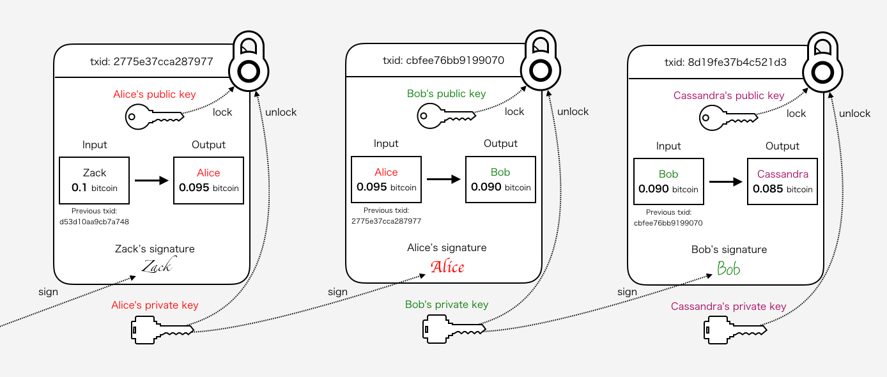

# ビットコインの仕組み

## はじめに

ビットコインの解説ページって結構たくさんありますが、
どこも分かりやすく説明しようとするあまり抽象的な説明になってしまっていたり、
アルゴリズムや処理の実態が省略されてしまっていて
「じゃあこういう時どうなるのよ？」みたいな疑問が残りがちな気がします。
そんな時、以下の本を読んで意識が変わりました。

 - [ビットコインはどのようにして動いているのか？ 数学を使わずに理解するビットコインの動作原理 ｜ 大石哲之 ｜ 金融・投資 ｜ Kindleストア ｜ Amazon](https://www.amazon.co.jp/%E3%83%93%E3%83%83%E3%83%88%E3%82%B3%E3%82%A4%E3%83%B3%E3%81%AF%E3%81%A9%E3%81%AE%E3%82%88%E3%81%86%E3%81%AB%E3%81%97%E3%81%A6%E5%8B%95%E3%81%84%E3%81%A6%E3%81%84%E3%82%8B%E3%81%AE%E3%81%8B%EF%BC%9F-%E6%95%B0%E5%AD%A6%E3%82%92%E4%BD%BF%E3%82%8F%E3%81%9A%E3%81%AB%E7%90%86%E8%A7%A3%E3%81%99%E3%82%8B%E3%83%93%E3%83%83%E3%83%88%E3%82%B3%E3%82%A4%E3%83%B3%E3%81%AE%E5%8B%95%E4%BD%9C%E5%8E%9F%E7%90%86-%E5%A4%A7%E7%9F%B3%E5%93%B2%E4%B9%8B-ebook/dp/B00IXF2SVS)

この本では、ビットコインが解決したかった事から始まり、
トランザクション、ブロックチェーンの具体的な仕組みについて解説されています。
しかも、技術的な知識や用語をあまり使わない説明を意識されていて、
かつ詳細すぎない内容だったので、入門としては最適だと思う。
この本に出会い、ビットコインの解説ページなども読み直して
何となく自分なりに腹落ちできた部分も多くなってきました。
次のステップとして、「ここだってこういう事だよな」というような自分なりの理解を
どこかに体系的にまとめておく必要があるように感じたため、
ここでは↑の書籍を読んで理解した内容を軸にまとめ、
さらにこの書籍では触れられなかったもうすこし細かい部分について
他の書籍やサイトの情報を加えて解説を追加します。
自分が後で読み返したときに「そうだった！」と思える情報にしたい。

## トランザクション

