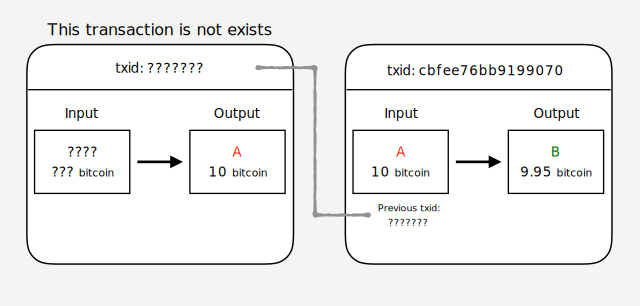
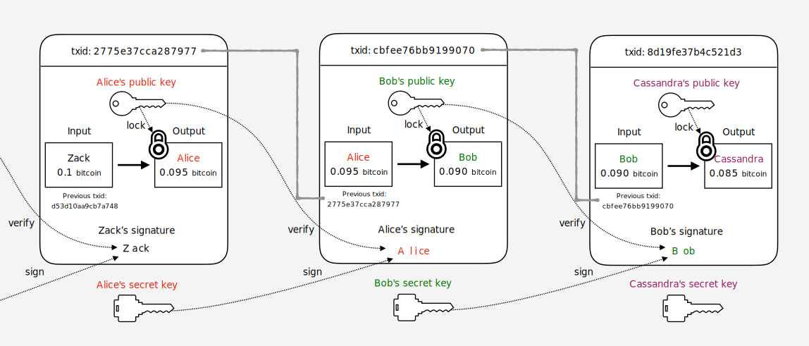

# ビットコイン 徹底解説

## はじめに

ビットコインの解説ページって結構たくさんありますが、
どこも分かりやすく説明しようとするあまり抽象的な説明になってしまっていたり、
アルゴリズムや処理の実態が省略されてしまっていて
「じゃあこういう時どうなるのよ？」みたいな疑問が残りがちな気がします。
そんな時、以下の本を読んで目から鱗が落ちました。

 - [ビットコインはどのようにして動いているのか？ 数学を使わずに理解するビットコインの動作原理 ｜ 大石哲之 ｜ 金融・投資 ｜ Kindleストア ｜ Amazon](https://www.amazon.co.jp/%E3%83%93%E3%83%83%E3%83%88%E3%82%B3%E3%82%A4%E3%83%B3%E3%81%AF%E3%81%A9%E3%81%AE%E3%82%88%E3%81%86%E3%81%AB%E3%81%97%E3%81%A6%E5%8B%95%E3%81%84%E3%81%A6%E3%81%84%E3%82%8B%E3%81%AE%E3%81%8B%EF%BC%9F-%E6%95%B0%E5%AD%A6%E3%82%92%E4%BD%BF%E3%82%8F%E3%81%9A%E3%81%AB%E7%90%86%E8%A7%A3%E3%81%99%E3%82%8B%E3%83%93%E3%83%83%E3%83%88%E3%82%B3%E3%82%A4%E3%83%B3%E3%81%AE%E5%8B%95%E4%BD%9C%E5%8E%9F%E7%90%86-%E5%A4%A7%E7%9F%B3%E5%93%B2%E4%B9%8B-ebook/dp/B00IXF2SVS)

こういう説明が欲しかった！という感覚でした。
この本では、ビットコインが解決したかった事から始まり、
トランザクション、ブロックチェーンの具体的な仕組みについて解説されています。
しかも、難しい数式や技術的な知識、用語を極力使わない説明を意識されていて、
かつ詳細すぎない内容だったので、入門としては最適だと思う。
この本を読んだあと、改めてビットコインの解説ページなども読み直しました。
そうすることで、ビットコインの仕組みについて、何となく自分なりに腹落ちできる部分が多くなってきました。

次のステップとして、「ここってこういう事だよな」というような自分なりの理解を
どこかに体系的にまとめておく必要があるように感じたため、
ここでは↑の書籍を読んで自分が理解した内容を軸にその内容をまとめ、
さらにこの書籍では触れられなかったもうすこし細かい部分について
他の書籍やサイトの情報を加えて解説したいと思います。
自分が後で読み返したときに「そうだった！」と思える情報にしたい。

**※ 間違いや指摘がありましたら、 [本リポジトリのIssue](https://github.com/nsgeorge/gh-pages/issues)にコメント頂けると助かります。**

## 登場する用語まとめ

| 用語 | 意味 |
|---|----|
|ノード|ビットコインプロトコルに基づいたP2Pネットワークに参加しているコンピューターのこと|
|トランザクション|ビットコインの価値の移動を表すデータ構造。AさんがBさんに 1 ₿ 支払った、みたいな情報|
|ウォレット|トランザクションのアウトプットの利用や電子署名を行うための公開鍵／秘密鍵群|
|ブロック|トランザクションを取りまとめたデータ構造。1ブロック中に複数トランザクションがまとめられている|
|ブロックチェーン|中央管理者が不要な分散型台帳技術、あるいはその台帳データ。ブロック同士を繋げてデータの信頼性を高めることができる|
|Proof-Of-Work|見つけるために相当な量の計算が必要な値のこと。PoWと略される|
|マイニング|ブロックチェーンへ新規にブロックを繋げるために各ノードがPoWを探す作業|
|ビットコイン|ブロックチェーンを利用したP2P電子通貨システム。あるいは、このシステムで利用される通貨の単位|
|satoshi|1 ₿＝100,000,000 Satoshi|

※₿ = ビットコイン

## ビットコインのすごいところ

ビットコインの特徴としてよく挙げられるのが

> 中央管理を必要としないPeer to Peer(P2P)ネットワークで成り立っている

だと思います。中央管理、P2Pについては、

 - [ブロックチェーンと分散型データベースの違い ｜ BlockChain Online ブロックチェーンオンライン](https://blockchain-jp.com/guides/196)
 - [Bitcoin（ビットコイン）を調べると出てくる、P2P（ピアツーピア）って結局なに？ ｜ ビットコインニュース情報](https://bitcoin-matome.info/bitcoin/p2p/)

の説明がわかりやすかったのでご参照ください。
要約すると

 - 中央管理型の仕組み：データベース全体を取りまとめる管理者（サーバー）が全てのデータを管理する
 - P2P型の仕組み：分散したネットワークに参加する各ノードが各自でデータを管理する

ということです。中央管理型の仕組みとしては「銀行」などがそれにあたると思います。
次に、「じゃあ、P2P型だとどういう良いことがあるの？」については、

 - 対障害性に優れる（＝システムがダウンしにくい）
 - 中央の管理者がいないため、取引の管理コストを低コストに抑えられる
 - サイバー攻撃の単一障害点がない（＝セキュリティに強い）

といったメリットが挙げられます。
じゃあ、全部P2P型で作ればええやん！となりますが、
以下の問題が出てきます。

 - [ビザンチン将軍問題 - Wikipedia](https://ja.wikipedia.org/wiki/%E3%83%93%E3%82%B6%E3%83%B3%E3%83%81%E3%83%B3%E5%B0%86%E8%BB%8D%E5%95%8F%E9%A1%8C)

データがネットワーク上のあちこちに分散した状態で、
各ノード（コンピューター）が「これが正しいデータの状態だ！」と判断するのはかなり難しい事です。
特にコンピューターの世界では、不具合が起きておかしなデータを送ってくる者や、
意図的に不正なデータを送ってくる者などがいるため、誰かが中央でデータを管理し、
「このデータは信頼できる、このデータは不正だ」など判断しない限り、
ネットワーク全体で整合性の取れた状態を保つことは大変困難と言えます。

これに対し、2008年にSatoshi Nakamotoさん（※このNakamotoさん、かなり謎が多く個人なのかグループなのか正体は今も明らかになっていません。）
が新しい電子通貨システムを提案しました。

 - [Bitcoin: A Peer-to-Peer Electronic Cash System](https://bitcoin.org/bitcoin.pdf)

これがビットコインです。
この論文で説明されているビットコインの仕組みは、
まさに上述したビザンチン将軍問題を解決するものでした。

## ビットコインが解決する２つの問題

先程、P2P型の仕組みではネットワーク全体のデータの管理がむずいと述べました。
では、ビットコインではどのようにこのデータを管理しているか具体的に説明していきます。
まず、通貨をやり取りするシステムをP2P型で構築する場合に解決すべき課題があります。
それは、「取引（送金、出金など）に不正がない事を保証する」ことです。
大きく2つのパターンについて見ていきます。

#### ①　自分が持ってないお金を勝手に使う系

 - A「Bさんに10万円送金します！（1万しか残高ないけど）」

とか

 - A「俺俺！俺Bだから口座のお金使っちゃうね！」

みたいな不正な取引を検証できる必要があります。

#### ②　2重支払い系

本人が意図して不正を働く場合、あるいはシステムの処理タイミングの関係で

 - A「貯金の全額1000円をBに送るね」
 - A「あ、Cにも1000円送らないと・・・あれ、送れちゃった！」

という2重支払いが発生してしまう可能性があり、これも防ぐ必要があります。

#### どうやって解決するか

ビットコインでは、①、②ともにそれぞれ具体的な解決方法が示されています。

そして、その結果`「全ユーザーの残高について全ノードが一意な認識を得ること」`を実現しています！！

①については「[トランザクション](#トランザクション)」で、
②については「[ブロックチェーン](#ブロックチェーン)」でどのように解決されるのか説明します。

## トランザクション

「①　自分が持ってないお金を勝手に使う系」の問題はなんとしてでも防がないといけません。
普通に考えると、ユーザーが本人かどうかパスワードとかで認証して、
認証に成功したらその口座へのアクセスを許して・・・みたいなステップが必要です。

ビットコインでは、上のようなユーザー認証などとは全く異なるユニークな方法でユーザーの残高を管理します。
この仕組を理解するためには「トランザクション」という概念を知る必要があります。

トランザクションとは、ビットコインにおける価値の移動を表すデータ構造です。
もう少し簡単に言うと

 - Aさんの 1 ₿ をBさんに 0.5 ₿ 支払います（₿ = ビットコイン）

という情報を1つの単位とするようなデータです。
この誰から誰にの部分は「Input」「Output」と呼ばれています。

 - Aさんの 1 ₿ を　→　`Input`
 - Bさんに 0.5 ₿ 支払います　→　`Output`

面白いのは、このトランザクションは過去のデータから全てチェーン状に繋がっており、
トランザクションのOutputは次のトランザクションのInputとして利用することができます。
ちょうど、以下の図のような感じです。

---

*トランザクションの概要*

---

この図は、

 1. ZackからAliceへ 0.095 ₿ 支払う
 1. AliceからBobへ 0.090 ₿ 支払う
 1. BobからCassandraへ 0.085 ₿ 支払う

というトランザクションのつながりを表しています。
txidは「トランザクションID」と呼ばれるトランザクションを識別するためのIDです。
図に示すとおり、誰かからビットコインを受け取る（Outputになる）と、
次のトランザクションでそのビットコインを使う（Inputにする）事ができます。

また、トランザクション内のInputとOutputのビットコインの金額が一致していない事が分かります。
この差額は「トランザクション手数料」と呼ばれる送金手数料で、
トランザクションを生成するたびに一定額の手数料が発生します。
このためInput = Outputとはなりません
（これについては後述します。またトランザクション手数料の金額は例なので実際の手数料とは異なります）。

最後に重要なポイントとして、各トランザクションは1つ前のトランザクションIDを保持しているという点です。
このIDを追跡することで、Inputとして設定されているビットコインがどういう流れでやってきたか過去にさかのぼって調べる事が可能です。

この段階で

 - A「Bさんに 10 ₿ 送金します！（ 1 ₿ しか残高ないけど）」

的な不正行為を防げそうな事が分かると思います。
なぜなら、Aさんが手元にない 10 ₿ をBさんに送金するためには、以下の図のように

---

*不正なトランザクションの例*

---

「？？？さんからAさんに 10 ₿ の支払いがあった」というトランザクションのOutputが必要になり、
もちろんそんなトランザクションは存在しませんので、
結果としてこういった不正なトランザクションを作ることはできないという事になります。

次に、

 - A「俺俺！俺Bだから口座のお金使っちゃうね！」

といった別の人物になりすました不正利用のパターンについて説明します。

---

*トランザクションのデータ構造*

---

上の図を見てください。訳が分からないと思います。

## ブロックチェーン

## マイニング

## ブロックチェーン攻撃

 - [暗号通貨史上で最も大きいブロックチェーンへの攻撃について。モナコインでの事件の重要性。 ｜ JunyaHirano.com](https://junyahirano.com/about_selfish_mining/)
