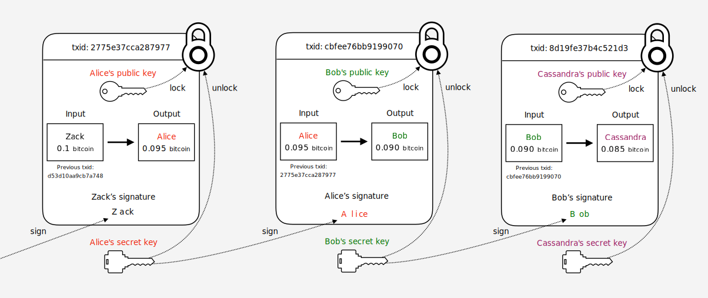

# ビットコインの仕組み

## はじめに

ビットコインの解説ページって結構たくさんありますが、
どこも分かりやすく説明しようとするあまり抽象的な説明になってしまっていたり、
アルゴリズムや処理の実態が省略されてしまっていて
「じゃあこういう時どうなるのよ？」みたいな疑問が残りがちな気がします。
そんな時、以下の本を読んで意識が変わりました。

 - [ビットコインはどのようにして動いているのか？ 数学を使わずに理解するビットコインの動作原理 ｜ 大石哲之 ｜ 金融・投資 ｜ Kindleストア ｜ Amazon](https://www.amazon.co.jp/%E3%83%93%E3%83%83%E3%83%88%E3%82%B3%E3%82%A4%E3%83%B3%E3%81%AF%E3%81%A9%E3%81%AE%E3%82%88%E3%81%86%E3%81%AB%E3%81%97%E3%81%A6%E5%8B%95%E3%81%84%E3%81%A6%E3%81%84%E3%82%8B%E3%81%AE%E3%81%8B%EF%BC%9F-%E6%95%B0%E5%AD%A6%E3%82%92%E4%BD%BF%E3%82%8F%E3%81%9A%E3%81%AB%E7%90%86%E8%A7%A3%E3%81%99%E3%82%8B%E3%83%93%E3%83%83%E3%83%88%E3%82%B3%E3%82%A4%E3%83%B3%E3%81%AE%E5%8B%95%E4%BD%9C%E5%8E%9F%E7%90%86-%E5%A4%A7%E7%9F%B3%E5%93%B2%E4%B9%8B-ebook/dp/B00IXF2SVS)

この本では、ビットコインが解決したかった事から始まり、
トランザクション、ブロックチェーンの具体的な仕組みについて解説されています。
しかも、難しい数式や技術的な知識、用語を極力使わない説明を意識されていて、
かつ詳細すぎない内容だったので、入門としては最適だと思う。
この本を読んだあと、改めてビットコインの解説ページなども読み直しました。
そうすることで、ビットコインの仕組みについて、何となく自分なりに腹落ちできる部分が多くなってきました。

次のステップとして、「ここってこういう事だよな」というような自分なりの理解を
どこかに体系的にまとめておく必要があるように感じたため、
ここでは↑の書籍を読んで理解した内容を軸に自分が理解した内容をまとめ、
さらにこの書籍では触れられなかったもうすこし細かい部分について
他の書籍やサイトの情報を加えて解説したいと思います。
自分が後で読み返したときに「そうだった！」と思える情報にしたい。

## 登場する用語まとめ

| 用語 | 意味 |
|---|----|
|トランザクション|ビットコインの取引のデータ構造。AさんからBさんに1bitcoinが渡った、みたいな情報|
|ブロック|トランザクションを取りまとめたタータ構造。1ブロック中に複数トランザクションがまとめられている|
|ブロックチェーン|ブロック同士を繋げてデータの信頼性を高めることができる分散型データベース|
|Proof-Of-Work|見つけるために相当な量の計算が必要な値のこと。PoWと略される|
|マイニング|ブロックチェーンへ新規にブロックを繋げためにPoWを探す作業|
|ビットコイン|ブロックチェーンを利用したP2P決済ネットワーク。あるいは、このネットワークの取引で利用される通貨の単位|
|satoshi|1ビットコイン＝100,000,000Satoshi|

## ビットコインのすごいところ

ビットコインの特徴としてよく挙げられるのが

> 中央集権的管理が必要ない分散型の仕組みである

だと思います。次に、「じゃあ、分散型だと何か良いことあるの？」という疑問に対しては、

 - 対障害性が高い（＝システムがダウンしにくい）
 - 処理の負荷を分散できるため高速に動作する

といったメリットが挙げられるでしょう。
しかし、世の中の銀行などを見てみるとすべて中央集権的管理の仕組みで実現されており、
ビットコインが発表されるまでは、一般的に普及している分散型の決済システムは存在しませんでした。
なぜか、、それは以下の問題を解決できなかったからです。

 - [ビザンチン将軍問題 - Wikipedia](https://ja.wikipedia.org/wiki/%E3%83%93%E3%82%B6%E3%83%B3%E3%83%81%E3%83%B3%E5%B0%86%E8%BB%8D%E5%95%8F%E9%A1%8C)

結局、分散した情報をもとに「これが正しい情報だ！」と判断するのはかなり難しい事です。
特にコンピューターの世界では、不具合が起きておかしな情報を送ってくる者や、
意図的に不正な情報を送ってくる者なのがおり、誰かが集中管理して
「君はOK、君はNG」と判断しない限り、全体で整合性の取れた決断は下せません。

しかし、2008年になり1本の論文が発表されました。

 - [Bitcoin: A Peer-to-Peer Electronic Cash System](https://bitcoin.org/bitcoin.pdf)

中本サトシという人物がとある電子決済システムを提案したのです。
この論文で説明されている仕組みは、まさにビザンチン将軍問題を解決するような内容でした。
（※この中本さん、かなり謎が多く個人なのかグループなのか正体は今も明らかになっていません。）

## トランザクション

## ブロックチェーン

## マイニング

