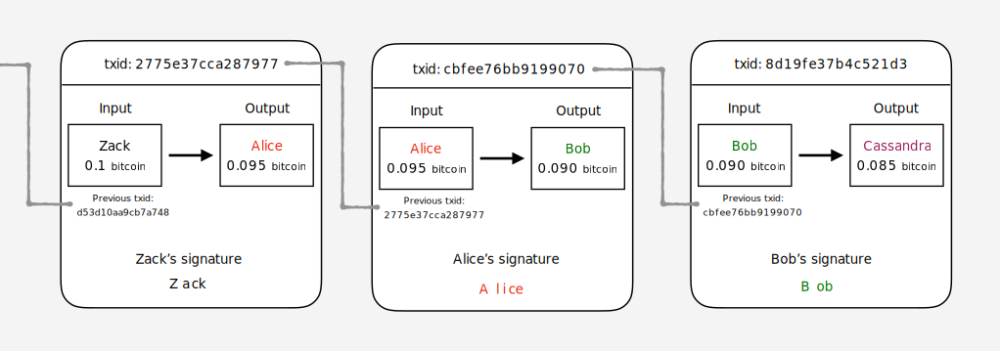
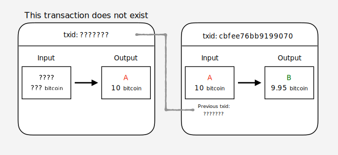
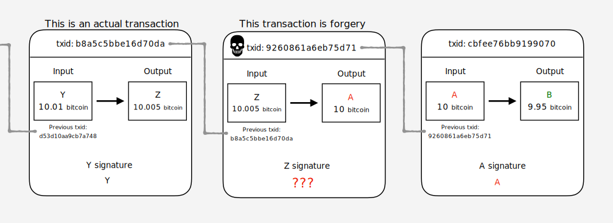
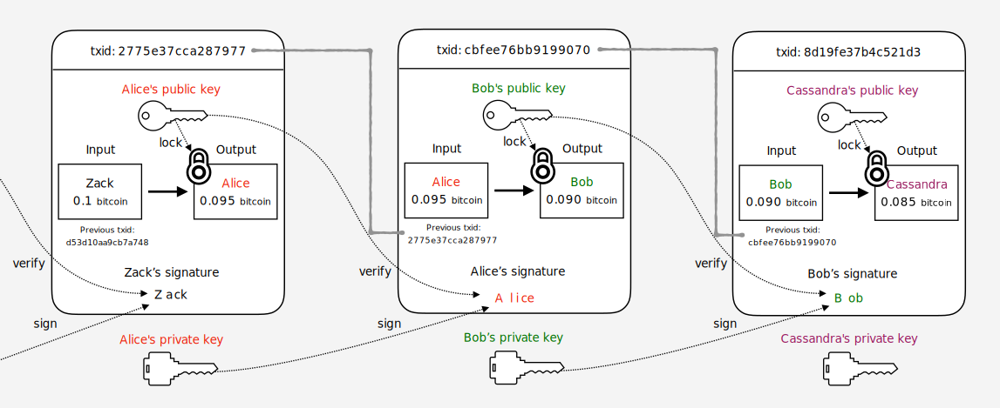

# ビットコイン 徹底解説

## はじめに

ビットコインの解説ページって結構たくさんありますが、
どこも分かりやすく説明しようとするあまり抽象的な説明になってしまっていたり、
アルゴリズムや処理の実態が省略されてしまっていて
「じゃあこういう時どうなるのよ？」みたいな疑問が残りがちな気がします。
そんな時、以下の本を読んで目から鱗が落ちました。

 - [ビットコインはどのようにして動いているのか？ 数学を使わずに理解するビットコインの動作原理 ｜ 大石哲之 ｜ 金融・投資 ｜ Kindleストア ｜ Amazon](https://www.amazon.co.jp/%E3%83%93%E3%83%83%E3%83%88%E3%82%B3%E3%82%A4%E3%83%B3%E3%81%AF%E3%81%A9%E3%81%AE%E3%82%88%E3%81%86%E3%81%AB%E3%81%97%E3%81%A6%E5%8B%95%E3%81%84%E3%81%A6%E3%81%84%E3%82%8B%E3%81%AE%E3%81%8B%EF%BC%9F-%E6%95%B0%E5%AD%A6%E3%82%92%E4%BD%BF%E3%82%8F%E3%81%9A%E3%81%AB%E7%90%86%E8%A7%A3%E3%81%99%E3%82%8B%E3%83%93%E3%83%83%E3%83%88%E3%82%B3%E3%82%A4%E3%83%B3%E3%81%AE%E5%8B%95%E4%BD%9C%E5%8E%9F%E7%90%86-%E5%A4%A7%E7%9F%B3%E5%93%B2%E4%B9%8B-ebook/dp/B00IXF2SVS)

こういう説明が欲しかった！という感覚でした。
この本では、ビットコインが解決したかった事から始まり、
トランザクション、ブロックチェーンの具体的な仕組みについて解説されています。
しかも、難しい数式や技術的な知識、用語を極力使わない説明を意識されていて、
かつ詳細すぎない内容だったので、入門としては最適だと思う。
この本を読んだあと、改めてビットコインの解説ページなども読み直しました。
そうすることで、ビットコインの仕組みについて、何となく自分なりに腹落ちできる部分が多くなってきました。

次のステップとして、「ここってこういう事だよな」というような自分なりの理解を
どこかに体系的にまとめておく必要があるように感じたため、
ここでは↑の書籍を読んで自分が理解した内容を軸にその内容をまとめ、
さらにこの書籍では触れられなかったもうすこし細かい部分について
他の書籍やサイトの情報を加えて解説したいと思います。
自分が後で読み返したときに「そうだった！」と思える情報にしたい。

**※ 間違いや指摘がありましたら、 [本リポジトリのIssue](https://github.com/nsgeorge/gh-pages/issues)にコメント頂けると助かります。**

## 登場する用語まとめ

| 用語 | 意味 |
|---|----|
|ノード|ビットコインプロトコルに基づいたP2Pネットワークに参加しているコンピューターのこと|
|ビットコイン|ブロックチェーンを利用したP2P電子通貨システム。あるいは、このシステムで利用される通貨の単位|
|ビットコインアドレス|ビットコインにおける口座番号のようなもの。各ユーザーの公開鍵から生成できる|
|ウォレット|ビットコインアドレス群とその秘密鍵を取りまとめる概念|
|トランザクション|ビットコインの価値の移動を表すデータ構造。AさんがBさんに 1 ₿ 支払った、みたいな情報|
|ブロック|トランザクションを取りまとめたデータ構造。1ブロック中に複数トランザクションがまとめられている|
|ブロックチェーン|非中央集権型の分散型台帳技術、あるいはその台帳データ。ブロック同士を繋げてデータの信頼性を高めることができる|
|Proof-Of-Work|見つけるために相当な量の計算が必要な計算問題のこと。PoWと略され、P2Pネットワークの合意形成に利用される|
|マイニング|ブロックチェーンへ新規にブロックを繋げるために各ノードがPoW解く作業|
|satoshi|1 ₿＝100,000,000 Satoshi|

※₿ = ビットコイン

## ビットコインのすごいところ

ビットコインの特徴としてよく挙げられるのが

> 非中央集権型のPeer to Peer(P2P)ネットワークで成り立っている

だと思います。中央集権型、あるいは非中央集権型（P2P）については、

 - [ブロックチェーンと分散型データベースの違い ｜ BlockChain Online ブロックチェーンオンライン](https://blockchain-jp.com/guides/196)
 - [Bitcoin（ビットコイン）を調べると出てくる、P2P（ピアツーピア）って結局なに？ ｜ ビットコインニュース情報](https://bitcoin-matome.info/bitcoin/p2p/)

の説明がわかりやすかったのでご参照ください。
要約すると

 - 中央集権型の仕組み：データベース全体を取りまとめる管理者（サーバー）が全てのデータを管理する
 - 非中央集権型の仕組み：分散したネットワークに参加する各ノードが各自でデータを管理する

ということです。中央集権型の仕組みとしては「銀行」などがそれにあたると思います。
次に、「じゃあ、非中央集権型（以降、P2P型）だとどういう良いことがあるの？」については、

 - 対障害性に優れる（＝システムがダウンしにくい）
 - 中央の管理者がいないため、取引の管理コストを低コストに抑えられる
 - サイバー攻撃の単一障害点がない（＝セキュリティに強い）

といったメリットが挙げられます。
じゃあ、全部P2P型で作ればええやん！となりますが、
以下の問題が出てきます。

 - [ビザンチン将軍問題 - Wikipedia](https://ja.wikipedia.org/wiki/%E3%83%93%E3%82%B6%E3%83%B3%E3%83%81%E3%83%B3%E5%B0%86%E8%BB%8D%E5%95%8F%E9%A1%8C)

データがネットワーク上のあちこちに分散した状態で、
各ノード（コンピューター）が「これが正しいデータの状態だ！」と判断するのはかなり難しい事です。
特にコンピューターの世界では、不具合が起きておかしなデータを送ってくる者や、
意図的に不正なデータを送ってくる者などがいるため、誰かが中央でデータを管理し、
「このデータは信頼できる、このデータは不正だ」など判断しない限り、
ネットワーク全体で整合性の取れた状態を保つことは大変困難と言えます。

これに対し、2008年にSatoshi Nakamotoさん（※このNakamotoさん、かなり謎が多く個人なのかグループなのか正体は今も明らかになっていません。）
が新しい電子通貨システムを提案しました。

 - [Bitcoin: A Peer-to-Peer Electronic Cash System](https://bitcoin.org/bitcoin.pdf)

これがビットコインです。ビットコインでは、P2P型の仕組みで動作するにもかかわらず、
そのネットワーク全体で整合性の取れた状態を保つことが可能です。
つまりビットコインの仕組みは、上述したビザンチン将軍問題を解決するアプローチだと言えます。

ちなみに

 - [ビットコイン上級者向けウォレット「ブロックチェーン」を徹底解説](https://coinpedia.cc/wallet-blockchain-info)

によると。ビットコインの稼働としては

 - 2010年5月：初決済
 - 2010年9月：初マイニング成功

らしいです。

## ビットコインが解決する２つの課題

先程、P2P型の仕組みではネットワーク全体のデータの管理がむずいと述べました。
では、ビットコインではどのようにこのデータを管理しているか具体的に説明していきます。
まず、通貨をやり取りするシステムをP2P型で構築する場合に解決すべき2つの課題があります。

#### ①　嘘の取引かどうか見極めないといけない

 - A「Bさんに10万円送金します！（1万しか残高ないけど）」
 - A「俺俺！俺Bだから口座のお金使っちゃうね！」
 - A「貯金の全額1000円をBに送るね」「あ、Cにも1000円送らないと・・・あれ、送れちゃった！」

みたいなやつですね。不正な取引なのでこれを見極めて「これはあかんやつ！」と判別できる必要があります。

#### ②　全ノードが全ユーザーの残高について共通の認識を持たないといけない

これが俗に言う「ビザンチン将軍問題」の課題です。
ビットコインのネットワークに参加しているノード（PC）群がそれぞれ違う残高を認識していては取引が破綻していまいます。

 1. 日本のノード   「Aさんは100万持ってる。Bさんに10万円送金！世界中のノードたちよ、この取引確認して！」
 1. アメリカのノード「え、Aさんって5万しか持ってないんじゃないの？」
 1. 日本のノード   「いやいやAさんは確かに100万持ってるよ」
 1. アメリカのノード「ぁあん？！」

となってしまい、取引が成り立たなくなります。
このため、中央管理者なしに誰がいくらビットコインを持っているのかを
ノード全体で正確に認識する必要があります。

#### 解決策

ビットコインでは、①、②ともにそれぞれ具体的な解決方法が示されています。
①については「[トランザクション](#トランザクション)」で、
②については「[ブロックチェーン](#ブロックチェーン)」でどのように解決されるのか説明します。

## トランザクション

### トランザクションの概要

「①　嘘の取引かどうか見極めないといけない」の問題の解決策について解説します・・・が、
その前にそもそも何が難しいのか説明します。
まず、一般的な銀行を例にすると、銀行は中央集権型の仕組みなので

 - Aさん「Bさんに1万円送金したい！」
 - 中央管理サーバー「分かりました。まずはあなたがAさん本人か確認するのでカードとパスワードを入力してね」
 - Aさん「カードウィーン、ポチポチ、ほら、私です」
 - 中央管理サーバー「たしかに。じゃあ、Bさんに送っときます！」
 - Bさん「お、確かにAさんから1万振り込まれてる！」

という感じで、嘘の取引でないことを中央管理のサーバーが担保してくれます。
一方P2P型はどうかというと中央管理サーバーがいないので

 - 隣のノード「AさんがBさんに1万送信したってよ。記録してね」
 - 自分のノード「そ、そうなんだ。りょうかい（多分本当だよな・・・）」

って感じで周りに存在するノードたちから嘘か本当か分からない取引の情報が伝達されてくるだけです。
これだとその取引が信頼できる取引なのかわからないですよね。

この難しい課題に対してビットコインでは、
**過去の信頼できる取引を全て記録しておき、その取引の履歴と照合する**ことでユーザーの残高を管理します。
この仕組を理解するためには「**トランザクション**」という概念を知る必要があります。

トランザクションとは、ビットコインにおける価値の移動を表すデータ構造です。
もう少し簡単に言うと

 - Aさんの 1 ₿ をBさんに 0.5 ₿ 支払います（₿ = ビットコイン）

という情報を1つの単位とするようなデータです。
この誰から誰にの部分は「Input」「Output」と呼ばれています。

 - Aさんの 1 ₿ を　→　`Input`
 - Bさんに 0.5 ₿ 支払います　→　`Output`

そして、トランザクションのOutputは次のトランザクションのInputとして利用することができます。
ちょうど、以下の図のような感じです。

---

*トランザクションの概要*

---

この図は、

 1. ZackからAliceへ 0.095 ₿ 支払う
 1. AliceからBobへ 0.090 ₿ 支払う
 1. BobからCassandraへ 0.085 ₿ 支払う

というトランザクションのつながり、つまり過去の取引の履歴を表しています。
txidは「トランザクションID」と呼ばれるトランザクションを識別するためのIDです。
図に示すとおり、誰かからビットコインを受け取る（Outputになる）と、
次のトランザクションでそのビットコインを使う（Inputにする）事ができます。
このInputは、1つ前のトランザクションIDを参照する形になっており、
このトランザクションIDを追跡することで、
Inputとして設定されているビットコインがどういう流れでやってきたか、
誰がいくらのビットコインを持っていたのか過去にさかのぼってチェックする事が可能です。

また、各トランザクションにはInputとなった人の電子署名（signature）がついている事が分かります。
この電子署名があることで、確実に本人が作ったトランザクションであることが証明できます。
※電子署名の説明はビットコインの仕組みとは関係のない一般的な既存技術なので説明は割愛します！！

最後に、トランザクション内のInputとOutputのビットコインの金額が一致していない事が分かります。
この差額は「トランザクション手数料」と呼ばれる送金手数料で、
トランザクションを生成するたびに一定額の手数料が発生します。
このためInput = Outputとはなりません
（これについては後述します。またトランザクション手数料の金額は例なので実際の手数料とは異なります）。

### 不正なトランザクション

このように過去の取引を照合することで、

 - A「Bさんに 10 ₿ 送金します！（ 1 ₿ しか残高ないけど）」

的な不正行為を防げる事が分かると思います。
なぜなら、Aさんが手元にない 10 ₿ をBさんに送金するためには、以下の図のように

---

*不正なトランザクションの例*

---

「？？？さんからAさんに 10 ₿ の支払いがあった」というトランザクションのOutputが必要になり、
もちろんそんなトランザクションは存在しませんので、
結果としてこういった不正なトランザクションを作ることはできないという事になります。
なので、上のような不正なトランザクションを作って各ノードに検証をお願いしたとしても
「Inputになってるビットコインってどっから来たの？存在しなくない！？不正じゃない！？！？」
となり、その取引は破棄されてしまいます。

さらに、

 - A「俺俺！俺Zだから口座のお金使っちゃうね！」

といった別の人物になりすました不正利用のパターンについて説明します。
ここでは、AさんがZさんになりすまして、偽のトランザクションを作る場合を例にしてみます。
この場合は、実在するトランザクションから偽のトランザクション（ZさんのビットコインをAさんに支払うやつ）を作り出す必要がありますが、
偽のトランザクションでInputとなる人（ここではZさん）の電子署名は本人であるZさんでしか生成できないため、
Aさんが偽のトランザクションを作ったとしても（真ん中のトランザクション）、
Zさんの署名がもらえないので成立しません（真ん中のトランザクションのZ signatureにZさんの署名がほしい）。
以下の図の通りです。（図中のドクロマークが偽のトランザクションを表してます）

---

*不正なトランザクションの例その２*

---

つまり、実在するトランザクションから勝手にビットコインを別の人に支払わせる的なことは不可能である仕組みになっています。

### トランザクションの具体的な生成手順

ここまでの話をまとめつつ更に詳細にすると以下の図のようになります。

---

*トランザクションのデータ構造詳細*

---

順番に説明します。

まず、これまで登場してこなかった、「公開鍵」「秘密鍵」という概念が登場します。前提条件として各ユーザーは

 - 公開鍵（公開される鍵。Lock（暗号化）, 電子署名の検証に使える）
 - 秘密鍵（公開されない鍵。公開鍵のLockをUnlock（復号化）, 電子署名の生成に使える。絶対流出させちゃいけないやつ。）

をそれぞれ持っている状態です。
ここでは

 - 公開鍵でLockしたデータは、対となる秘密鍵でしかUnlockできない
 - 秘密鍵で生成した電子署名が本人のものかどうかは、対となる公開鍵でしか確認できない

というポイントのみ覚えてください。

上の図のうち、「Alice」を起点に「Bobに0.085 ₿ 支払う」というトランザクション（上の図の真ん中のトランザクション）を生成する流れを見ていきます。

まず、最初に重要なのがAliceがBobに支払うためのビットコインに相当するトランザクションOutputを持っているか、というところです。
これは上の図でいう一番左の「ZackからAliceへのビットコイン支払いのトランザクション」のOutputがそれにあたります。
なので、ここはクリアということになります。

次に、左のトランザクションのOutputを使う（真ん中のトランザクションのInputにする）ために、
Aliceは自身のウォレットにある秘密鍵で左のトランザクションのアウトプットをUnlockする必要があります。
これはどういうことかというと、実は各トランザクションのOutputは指定された公開鍵でLockされています。
このため、この指定された公開鍵に対応する秘密鍵を持つ人だけがそのトランザクションのOutputをUnlockして使う事ができる、という事になります。
上の図で説明すると、

> 各トランザクションのOutputは指定された公開鍵でLockされています

の部分は、左のトランザクションの「Alice's public key」がOutputをLockしている部分に該当します。
このLockは、左のトランザクションの下にある「Alice's private key」でのみUnlockして利用することができます。
なので、ここではAlice's private keyでOutputをUnlockすることになります。

Aliceはこの段階でZackからもらったビットコインを使う準備が整いました。
今度は、送金したい相手のビットコインアドレス（=対になる公開鍵がある）を指定し、
そのビットコインアドレスに対していくらのビットコインを送金するかを指定します。

上の図でいうと、Aliceは真ん中のトランザクションにある「Bob's public key」に対して、
「0.090 ₿ 」を送りますと宣言します。
この宣言により、Aliceによって真ん中のトランザクションが作られることになります。

最後にAliceは「これは私本人が作ったトランザクションです」ということを証明するため、
自身の秘密鍵で真ん中のトランザクションに電子署名を追加します。
これ上の図の真ん中のトランザクションの「Alice's signature」の部分です。

これで、AliceからBobに0.090 ₿ を支払うトランザクションが完成しました。
完成したトランザクションはビットコインネットワークに配信され、
数秒で全てのノードに情報が行き渡ります。もちろんBobもこのトランザクションが作られたという通知を受けます。
整理すると、上の図でいうと真ん中のトランザクションが今完成した新しいトランザクションで、
左のトランザクションが1つ前のトランザクションという状態です。

最後の仕上げとして、Bobはこの新しいトランザクションがAlice本人が作ったトランザクションかどうかを検証する必要があります。
この検証はとても簡単で、上の図でいう真ん中トランザクションに含まれている電子署名（Alice's signature）に対して、
1つ前のトランザクションの公開鍵（Alice's public key）を使ってチェックしてあげればOKです。
各トランザクションの公開鍵はネットワーク上で公開されているデータなので誰でも利用することができます。

これらがトランザクションを生成する一連の流れです。

 - トランザクションを作る際に送金相手の公開鍵を指定する
 - その公開鍵が次のトランザクションの電子署名の検証に利用される
 
という2つのポイントはかなり重要です。
AliceがBobへビットコインを送金する最初の段階で、「Bob's public key」を指定していましたが、
これはつまり、「送金後のビットコインは、Bob's public keyの対となる秘密鍵を持つ人物だけが利用できるよ」
という事を意味しています。つまり、送金後のビットコインの所有権がBobに移ったということですね。

### トランザクションの節の補足説明

> トランザクションのOutputは指定された公開鍵でLockされています

実際には、`Locking script`というスクリプト言語による条件記述でLockされているのですが、一般的に公開鍵もそのLockに含まれているため、簡略化のために公開鍵でLockしている、と表現しています。

> このため、この指定された公開鍵に対応する秘密鍵を持つ人だけがそのトランザクションのOutputを使う事ができる、という事になります。

実はこの概念はかなり重要です。というのも、「公開鍵に対応する秘密鍵を持つ人」というのは、
言い換えると、「公開鍵に対応する秘密鍵さえ持っていれば誰でも」と読み替える事ができます。
このため、秘密鍵が流出してしまうと簡単に他の人にビットコインを盗まれてしまいます。
ただし、通常はこの公開鍵に対応する秘密鍵はその本人しか持っていないはずなので、
結果的に本人しかそのトランザクションのOutputを使えない、ということになります。

## ブロックチェーン

## マイニング

## その他ネタ

#### ビットコインの承認って時間かかるけど取引で使えるの？
#### トランザクション手数料と承認速度の関係性
#### base58check
#### Vanity address
#### SPVノードのトランザクション検索におけるプライバシーリスク
#### Markle treeとMarke path
#### extra nonceによるマイニングの必要性
#### Difficulty targetと電気代
#### マネージドプール
#### Alt coin

 - Coloredcoin
 - Primecoin
 - Namecoin

#### ソフトフォークとハードフォーク

 - [仮想通貨のハードフォークとは｜仕組み・メリットデメリットを解説-coinge（コインジ）仮想通貨・ブロックチェーンの情報サイト](https://coinge.jp/post-63)

#### ブロックチェーン攻撃

 - [暗号通貨史上で最も大きいブロックチェーンへの攻撃について。モナコインでの事件の重要性。 ｜ JunyaHirano.com](https://junyahirano.com/about_selfish_mining/)

## 参考ページ

 - [どうやってこのビットコインが自分のって事を証明できるの？ – yuzushioh – Medium](https://medium.com/@yuzushioh/%E3%83%93%E3%83%83%E3%83%88%E3%82%B3%E3%82%A4%E3%83%B3%E3%81%AE%E3%82%A2%E3%83%89%E3%83%AC%E3%82%B9-112d9c0a4b31)